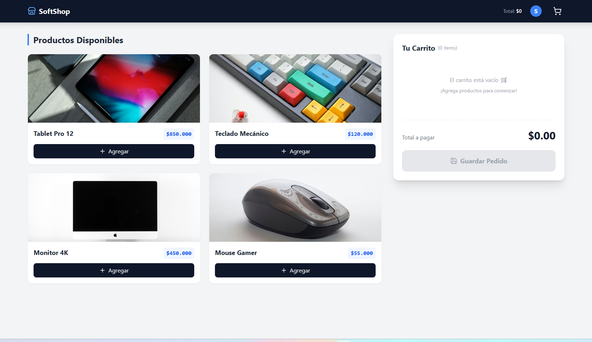

# SoftSeguros Ecommerce Challenge



Prueba técnica Full Stack implementando un mini-ecommerce con persistencia de carrito, arquitectura de microservicios y dockerización para producción.

## Tecnologías

* **Frontend:** React 18, TypeScript, TailwindCSS, Vite.
* **Backend:** Python 3.10, FastAPI, SQLAlchemy, SQLite.
* **Infraestructura:** Docker, Docker Compose, Nginx (Multi-stage build).
* **CI/CD:** GitHub Actions.

## Instalación y Ejecución (Recomendado)

La forma más sencilla de correr el proyecto es utilizando **Docker Compose**, lo que levanta todo el entorno (Frontend + Backend + BD) con un solo comando.

1.  **Clonar el repositorio:**
    ```bash
    git clone <tu-repo-url>
    cd softseguros-test
    ```

2.  **Levantar la aplicación:**
    ```bash
    docker-compose up --build
    ```

3.  **Acceder:**
    **Frontend (Tienda):** http://localhost:3000
    **Backend Docs (Swagger):** http://localhost:8000/docs

---

## Ejecución Manual (Modo Desarrollo)

Si deseas correr los servicios por separado en tu máquina local sin Docker:

### Backend
```bash
cd backend
pip install -r requirements.txt
# El sistema creará automáticamente la BD y los datos de prueba (Seed)
uvicorn app.main:app --reload
# Corre en http://localhost:8000
cd frontend
npm install
npm run dev
# Corre en http://localhost:5173


### Decisiones de Arquitectura
Persistencia Híbrida & UX:

LocalStorage: Se implementó para mejorar la experiencia de usuario (UX), permitiendo que el carrito sobreviva a recargas de página accidentales antes de la confirmación.

SQLite: Base de datos relacional ligera para persistir las órdenes confirmadas, ideal para prototipos rápidos y pruebas técnicas portables.

Docker Multi-stage Build:

Para el Frontend, no se expone el servidor de desarrollo (vite dev). En su lugar, se compila la aplicación (npm run build) y se sirve mediante Nginx Alpine. Esto simula un entorno de producción real, reduce el tamaño de la imagen y mejora la seguridad/rendimiento.

Clean Architecture & Estado:

Se utilizó React Context + Hooks personalizados (useCart) para manejar el estado global. Esto evita la complejidad innecesaria de Redux para este alcance, manteniendo el código legible, nativo y fácil de testear.

El Backend sigue el patrón de Schemas (Pydantic) y Models (ORM) para separar la validación de datos de la lógica de base de datos.

### Funcionalidades Extras Implementadas

- Dockerización Completa: docker-compose orquesta Frontend, Backend y volúmenes.

- Pipeline CI/CD: Flujo de trabajo en GitHub Actions para verificación automática.

- UI Moderna: Diseño responsive con TailwindCSS y formateadores de moneda (CLP).

- Auto-Seeding: El backend detecta si la DB está vacía y la puebla con productos iniciales.
